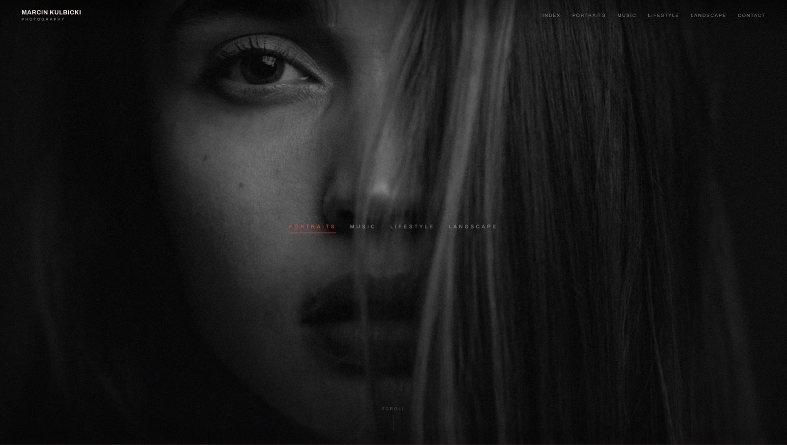
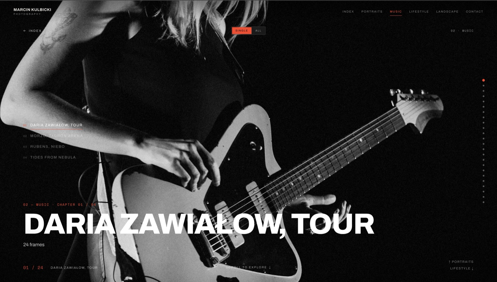
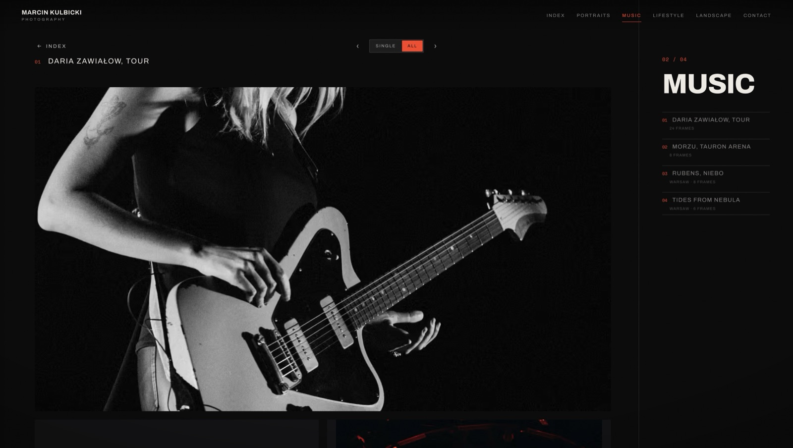
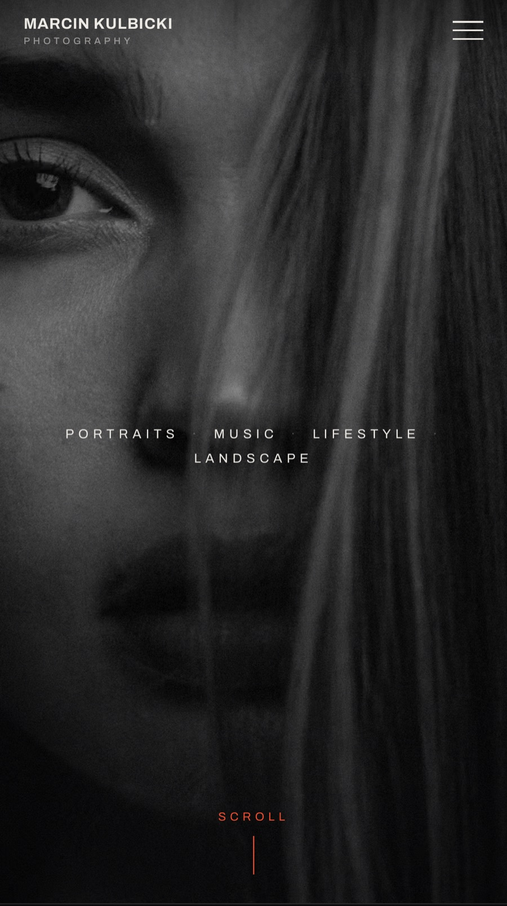
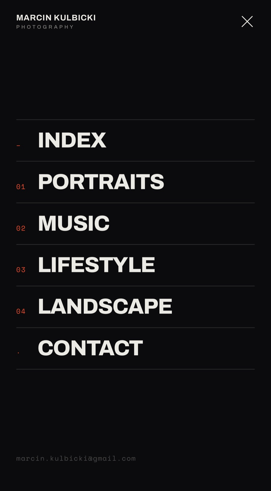
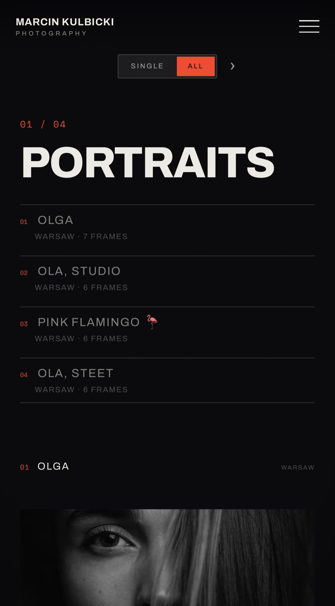

# Marcin Kulbicki — Photography Portfolio

A self-manageable, cinematic photography portfolio. A dark editorial front-end with a
bespoke hijacked-scroll engine (Single + All view modes) sits on top of a headless CMS,
so the owner publishes new work — sections, chapters, photos — **without a developer in
the loop**.

🔗 **Live:** [marcinkulbicki.com](https://marcinkulbicki.com)

> _Note: this is a portfolio/case-study README. It documents both the product and the
> way it was built — the build process is itself part of what this project demonstrates._

---

## Screens

**Landing** — full-bleed hero with the section index; one discrete scroll-step per section.



**Single mode** — one cinematic frame per chapter, hero-led, with a frame counter and the Single / All toggle.



**All mode** — an editorial overview of a whole section's chapters at once.



**Mobile** — full parity, not a reduced experience: both view modes and the hijacked-scroll
engine work via touch, with a dedicated menu overlay for navigation.

| Intro | Menu | Single mode | All mode |
| :---: | :---: | :---: | :---: |
|  |  |  |  |

---

## What it is

The site presents photography as an ordered tree: **Section → Chapter → Photo**. Visitors
explore it two ways:

- **Single mode** — one cinematic frame at a time, hero-led, full-bleed.
- **All mode** — an editorial overview of every section at once.

Navigation is driven by a custom **scroll-hijacking engine**: each scroll step advances one
discrete section rather than free-scrolling, recreating a deliberate, gallery-like pacing on
both desktop and touch.

All content is editorial data, not code. The owner logs into the CMS, adds a chapter or
reorders photos, and a webhook rebuilds and redeploys the static site automatically.

## Tech stack

| Layer | Choice | Why |
| --- | --- | --- |
| Framework | [Astro 6](https://astro.build/) | Static-first; ships zero JS except where islands are needed |
| Interactivity | [React 19](https://react.dev/) islands | The scroll engine + view modes are the only client-side JS |
| Language | [TypeScript 5](https://www.typescriptlang.org/) | Typed content model and engine state |
| Styling | [Tailwind CSS 4](https://tailwindcss.com/) + bespoke `portfolio.css` | Utility classes for layout, hand-authored CSS for the cinematic chrome |
| Content | [Sanity](https://www.sanity.io/) (headless CMS) | Self-managed publishing, no hand-built auth, no free-tier pausing |
| Hosting | [Cloudflare Workers Static Assets](https://workers.cloudflare.com/) | Edge-served static `dist/`, no SSR runtime |
| UI primitives | [shadcn/ui](https://ui.shadcn.com/) ("new-york") | A few accessible primitives where needed |

### Architecture at a glance

- **Static output, dynamic content.** `output: "static"` — content is fetched from Sanity
  **at build time** via a single GROQ query, so the live site has _no_ runtime dependency on
  the backend. If the CMS were offline, the published site keeps serving.
- **The CMS ships with the app.** Sanity Studio is embedded at `/admin` (client-rendered,
  hash-routed), so editing lives in the same deploy as the site.
- **Engine as an island.** The hijacked-scroll engine is a React island
  (`src/components/Portfolio.tsx` + `src/components/hooks/usePortfolioEngine.ts`); everything
  else stays static Astro. It was migrated from a vanilla-JS prototype during development.
- **Publish-without-code loop.** Sanity webhook → Cloudflare build → redeploy. Proven in
  production.

> The project began from the **10x Astro Starter** (Astro + React + TS + Tailwind +
> Cloudflare). The starter's bundled **Supabase** backend was removed and replaced with
> **Sanity** — the product needs self-managed _content publishing_, not user accounts, and
> a managed-auth CMS removed an entire auth surface from the build.

## How it was built

This project was developed **spec-first with an AI coding agent**, using a structured,
markdown-driven workflow (the 10xDevs AI Toolkit). Rather than ad-hoc prompting, every unit
of work flowed through durable artifacts under `context/`:

```
shape an idea  →  PRD  →  tech-stack + infra decisions  →  roadmap
                                                              │
            per change:  identity → plan → plan-review → implement → archive
```

- `context/foundation/` — the durable "what & why": shaping notes, PRD, tech-stack rationale,
  infrastructure choice, and the roadmap of vertical slices.
- `context/changes/<id>/` — one folder per change, each with a written **implementation
  contract** (plan), a compressed handoff, and recorded progress (commit SHAs written back
  after each phase).
- `context/archive/` — completed changes, frozen.

The result is a codebase where the _reasoning_ behind each decision is checked in alongside
the code, and the implementation was executed one verified slice at a time. The bespoke
front-end was ported from a captured **design reference** (`context/foundation/design-reference/`)
and verified for visual fidelity against it.

## Getting started

Requires **Node.js v22.14.0** (see `.nvmrc`).

```bash
npm install
npm run dev        # Astro dev server at http://localhost:4321
```

No `.env` is required to run — the Sanity project coordinates (`projectId`, `dataset`) are
public, non-secret values baked in as defaults. Override via `PUBLIC_SANITY_*` env vars only
if pointing at a different project.

Sanity Studio (content editing) is available at `/admin` once the dev server is running.

## Scripts

| Script | Does |
| --- | --- |
| `npm run dev` | Start the Astro dev server |
| `npm run build` | Build the static `./dist` (fetches content from Sanity at build time) |
| `npm run preview` | Preview the production build locally |
| `npm run deploy` | `astro build && wrangler deploy` to Cloudflare |
| `npm run lint` / `lint:fix` | ESLint (with project conventions enforced) |
| `npm run format` | Prettier + Astro + Tailwind class sorting |
| `npm run cf:tail` | Stream live Cloudflare logs |

## Project structure

```
src/
├─ components/        # Portfolio island + hooks, UI primitives
│  └─ hooks/          # usePortfolioEngine — the scroll engine state
├─ pages/             # index.astro (build-time Sanity fetch), /admin Studio mount
├─ sanity/            # client, env, GROQ queries, schema (section/chapter/photo)
├─ layouts/           # Astro layouts
├─ lib/               # helpers (cn(), services)
├─ styles/            # portfolio.css — the cinematic chrome
└─ types.ts           # shared types
sanity.config.ts      # Studio config (mounted at /admin)
context/              # spec-driven build artifacts (PRD, roadmap, change plans)
```

## Deployment

Deployed to **Cloudflare Workers Static Assets** via **Cloudflare Builds** — build + deploy
run automatically on push to `main`. No backend secrets are needed in the deploy; the public
Sanity coordinates live in code.

## Credits

Photography & concept: **Marcin Kulbicki**. Scaffolded from the 10x Astro Starter; built
with an AI-assisted, spec-driven workflow.
